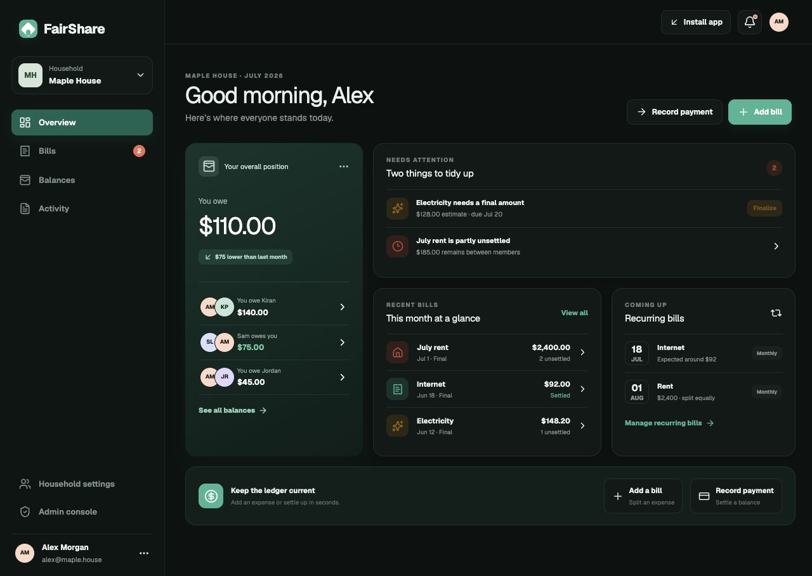
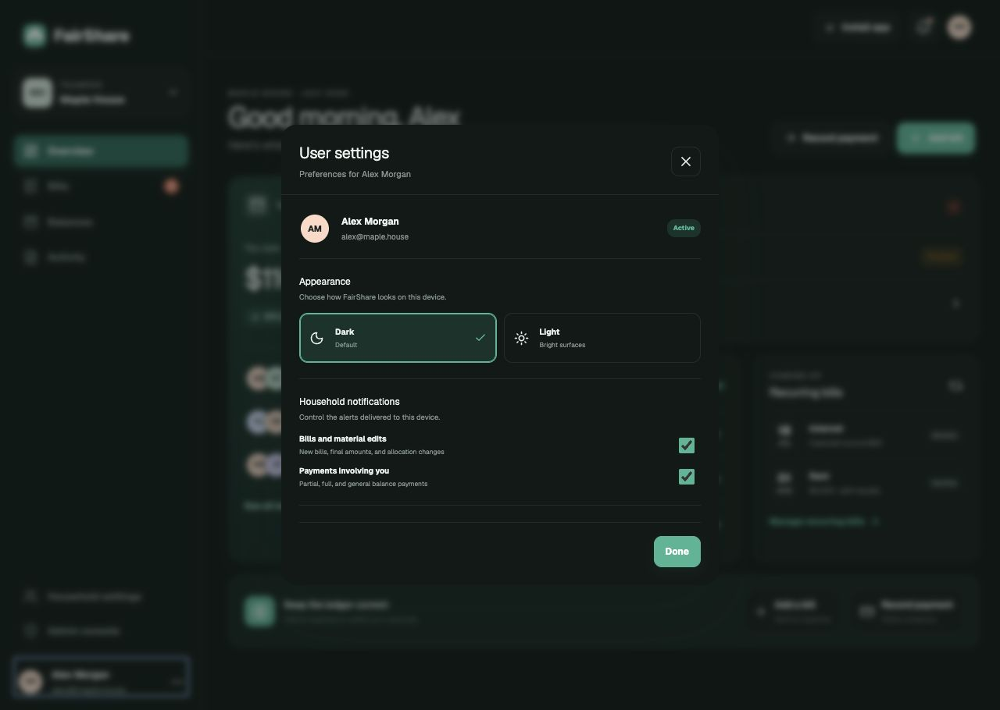
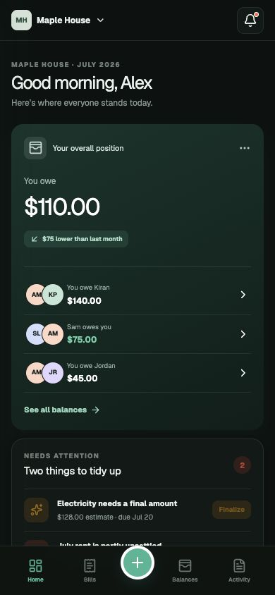

# FairShare

FairShare is a mobile-first Progressive Web App for understanding shared household expenses without turning the home into an accounting department. A Household records bills, who paid the external expense, how responsibility is allocated, and the repayments made between members. FairShare then explains the result in plain language: **“You owe Kiran $40”** or **“Sam owes you $125.”**

> [!IMPORTANT]
> This repository currently contains an interactive product prototype with illustrative data. It is suitable for evaluation and UI development, but it does **not** yet implement production account authentication, Household authorization, or durable server-side writes. Do not use this release for real financial data. See [Security](#security) and [SECURITY.md](SECURITY.md).

## Screenshots

### Household overview — default dark theme



### User appearance and notification settings



### Mobile dashboard



## Features

- Multiple Households with member-focused navigation.
- Clear person-to-person balances while preserving the underlying obligations.
- Bills with external contributions separated from member responsibility.
- Equal, percentage, and fixed-amount allocation interfaces.
- Partial bill repayments and general balance payments.
- Estimated bills that can later be finalized.
- Recurring-bill templates and Household onboarding.
- Chronological activity and meaningful bill-change history.
- Separate administrator-management surface.
- Installable PWA shell with offline fallback and push-notification handlers.
- Responsive desktop and mobile layouts.
- Dark mode by default, with a persistent light/dark toggle in user settings.
- Auditable D1/Drizzle schema for users, Households, membership, bills, contributions, allocations, obligations, payments, history, recurring templates, and notifications.

## Quick start with Docker Compose

Requirements: Docker Engine with the Compose plugin.

```bash
git clone https://github.com/KiranTheRam/FairShare.git
cd FairShare
docker compose up -d
docker compose ps
```

FairShare is then available at `http://127.0.0.1:3000`. Compose intentionally binds only to loopback. Put an HTTPS reverse proxy in front of it for access from a public domain.

To update:

```bash
docker compose pull
docker compose up -d
```

To build locally instead of pulling the published image:

```bash
docker compose build --pull
docker compose up -d
```

## Docker image

The GitHub Actions workflow builds `linux/amd64` and `linux/arm64` images and publishes them to:

```text
kirantheram/fairshare:latest
kirantheram/fairshare:sha-<commit>
```

The image runs as an unprivileged user and includes a health check at `/api/health`.

## Public-domain deployment guide

Do not expose container port `3000` directly. Keep the Compose loopback binding and terminate HTTPS at a maintained reverse proxy.

### Example: Caddy on the host

1. Point the domain's DNS record to the server.
2. Install Caddy using its official package for your operating system.
3. Start FairShare with `docker compose up -d`.
4. Add a site block to the Caddy configuration:

```caddyfile
fairshare.example.com {
    encode zstd gzip
    reverse_proxy 127.0.0.1:3000
}
```

5. Reload Caddy and confirm that HTTPS is active.

Until application-owned login and Household authorization are implemented, place an identity-aware proxy in front of FairShare and restrict access to approved users. Examples include Authelia, Authentik, Cloudflare Access, or an OAuth2 Proxy deployment.

### Recommended production controls

- Enable automatic TLS renewal and redirect HTTP to HTTPS.
- Permit inbound traffic only on ports `80` and `443`; keep `3000` private.
- Back up persistent application data once the production database is connected.
- Pin image versions for controlled upgrades instead of relying on `latest`.
- Run container and dependency vulnerability scans on every release.
- Monitor health checks, reverse-proxy errors, and authentication events.

## Local development

Requirements: Node.js `>=22.13.0`.

```bash
npm ci
npm run dev
```

Useful checks:

```bash
npm run lint
npm test
npm audit --omit=dev
docker build -t fairshare:local .
```

## Architecture

- Next.js-compatible App Router rendered by [Vinext](https://github.com/cloudflare/vinext).
- React 19 UI and Lucide icon system.
- Cloudflare Worker-compatible build output for OpenAI Sites.
- Drizzle schema and D1 migration under `db/` and `drizzle/`.
- Service worker and web app manifest under `public/` and `app/manifest.ts`.
- Multi-stage, non-root container build and hardened Compose defaults.

The ledger model keeps these as distinct records rather than storing only a mutable balance:

```text
Bill
 ├─ external contributions (who paid the vendor)
 ├─ allocations (who is responsible)
 ├─ obligations (who owes whom)
 ├─ bill-specific repayments
 └─ financial-term change history

General payments reduce pairwise balances without modifying bill terms.
```

## Security

The current prototype includes a restrictive Content Security Policy, clickjacking and MIME-sniffing protection, referrer and permissions policies, private HTML caching, a non-root container, dropped capabilities, a read-only Compose filesystem, and loopback-only port binding.

Those controls harden the delivery layer; they do not replace application security. Production use still requires server-side authentication, Household-scoped authorization, administrator-role enforcement, CSRF defenses, validated writes, rate limiting, audit logging, durable encrypted storage, and backup/restore testing. Read [SECURITY.md](SECURITY.md) before deploying on a public domain.

## License

See [LICENSE](LICENSE).
